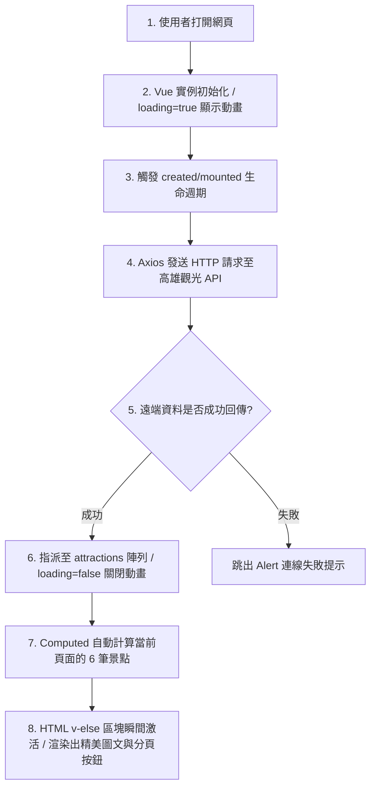

# 🌴 高雄旅遊網專案架構說明書 (Vue 3 + Bootstrap 5)

本專案採用 **Vue 3 漸進式框架** 搭配 **Bootstrap 5 響應式網格**，透過 **Axios** 異步串接遠端高雄旅遊觀光開放資料，並實作前端資料分頁與 CSS 視覺動畫特效。

---

## 📂 專案檔案結構與階層樹 (Directory Tree)

單一網頁檔案（`試抓API.html`）內部核心結構與技術分層如下：

```text
📁 試抓API.html (單一網頁核心)
├── 📄 HTML 骨架層 (視覺元件結構)
│   ├── <head> 元數據區：設定編碼、引入外部資源庫 (Bootstrap, Vue, Axios)
│   └── <body> 主體渲染區：視覺容器
│       └── <div id="app"> Vue 3 核心掛載總節點
│           ├── 🔄 Loading 載入動畫狀態區塊 (v-if="loading")
│           ├── 🎴 景點卡片響應式網格系統 (v-else -> row -> col -> card)
│           └── 🔢 頁碼切換導覽列組件 (nav -> pagination -> page-link)
│
├── 🎨 CSS 樣式層 (控制排版與動態視覺)
│   ├── 📦 Bootstrap 5 (外部 CDN 框架：處理 RWD 行動裝置適配與元件基礎外型)
│   └── ✏️ 自訂 <style> (在地樣式：處理圖片 hover 縮放 1.1 倍、三行文字溢出省略號)
│
└── ⚙️ JavaScript 邏輯層 (資料流與動態行為大腦)
    ├── 🌐 外部核心庫引入：Vue 3 全域版、Axios 聯網異步套件
    └── 🧠 核心邏輯控制核 (Options API 結構)：
        ├── 💾 data (響應式變數儲存)：attractions[] (景點總庫), currentPage (當前頁碼)
        ├── ⚡ methods (行為觸發函式)：getApiData() (負責連線遠端 API 撈取資料)
        ├── 🧮 computed (即時數據加工廠)：currentData (動態切割出當頁 6 筆), totalPages (計算總頁數)
        └── ⏳ created / mounted (生命週期)：當網頁初始化完成時，自動發起請求
```

---

## 📊 程式碼階層詳細解析表


| 階層結構 (Layer) | 關鍵標籤 / 語法屬性 | 核心職責與技術說明 | 本專案實體對應內容 |
| :--- | :--- | :--- | :--- |
| **1. 元數據設定層** | `<head>`, `<meta>`, `<title>` | 定義網頁編碼，拉取線上樣式庫（CSS）與核心框架（JS CDN）。 | 設定 `UTF-8` 防亂碼、拉取 Bootstrap 5、Vue 3 與 Axios 外部連結。 |
| **2. 視圖控制容器** | `<div id="app">` | HTML 與 JavaScript 的物理連接點，劃定 Vue 的活動與控制邊界。 | 對應腳本底部的 `.mount('#app')`，大括號語法只有在此容器內才會被解析。 |
| **3. 排版網格系統** | `container`, `row`, `col-md-4` | 負責網頁的 **RWD 響應式佈局**，確保在手機、平板與電腦上能自動排版。 | `container` 負責置中留白，`row` 內層利用 `col` 卡片在桌面顯示 3 欄、手機變單欄。 |
| **4. 資料驅動條件** | `v-if`, `v-else`, `v-for` | 根據變數狀態動態切換 HTML 結構，免去手動操作 DOM 的繁瑣步驟。 | `loading` 為真顯示轉圈圈；資料回傳後，利用 `v-for` 將景點陣列自動循環複製。 |
| **5. 資料數據綁定** | `{{ spot.Name }}`, `:src="..."` | 將 JavaScript 變數中的真實欄位，動態且安全地渲染、替換到網頁表面。 | 將 API 撈回來的 `Name`、`Add`、`Picture1` 欄位，精準塞入卡片的標題、地址與圖片。 |
| **6. 連網非同步控制**| `axios.get(url)` | 負責與外部伺服器連線，打破本地 `file://` 安全協議限制，抓取線上大數據。| 向六角學院維護的高雄旅遊 JSON 發送 `GET` 請求，下載數實體景點資料。 |
| **7. 數據即時工廠** | `computed` (計算屬性) | 監聽資料狀態，當原始大陣列發生改變或切頁時，即時運算出符合當下所需的片段。| 由於資料量龐大，透過邏輯將其利用 `.slice()` 切割，每頁僅將 6 筆（`currentData`）交給網頁呈現。 |

---

## 🔄 資料流動生命週期 (Data Lifecycle)


