# 相依圖：L1 基礎建設層

> 涵蓋範圍：`src/store/*.ts`、`src/composables/*.ts`、`src/lib/**/*.ts`、`src/data/*.ts`、`src/utils/*.ts`。
> 共 14 個檔案 / 19 個節點 / 26 條邊。
>
> 更新註記：
>
> - `shortcutStore` 已於 CR-08 後續清理時移除（其本地 undo/redo 與 historyStore 不通且無實際呼叫點）；useShortcuts 已改接到 historyStore。
> - 新增 detector `E001_deviceOverlap`（CR-03，shirone 草稿遷移結果，邏輯尚為 stub）。

## 圖

```mermaid
flowchart TD
    %% ──────────────────────────────────────────────
    %% Pinia Stores
    %% ──────────────────────────────────────────────
    editorStore["<b>useEditorStore</b><br/>兼任 placedDevice + pipeline，藍圖節點/管線與工具狀態<br/>━━━━━<br/>nodes / edges<br/>activeTool / placementArmed<br/>placeDevice() / moveDevices()<br/>setRecipe() / pasteSelection()<br/>addConnection() / removeConnection()"]

    historyStore["<b>useHistoryStore</b><br/>Command Pattern 歷史堆疊，無限 undo/redo<br/>━━━━━<br/>undoStack / redoStack<br/>canUndo / canRedo<br/>execute(cmd)<br/>undo() / redo()<br/>clear()"]

    canvasStore["<b>useCanvasStore</b><br/>純畫布視圖狀態，不進歷史<br/>━━━━━<br/>zoom / offset / gridSize<br/>baseRegion / showGrid<br/>setZoom() / setOffset()<br/>setBaseRegion() / toggleGrid()"]

    validationStore["<b>useValidationStore</b><br/>收集 detector 結果，供 FlowEngine 過濾<br/>━━━━━<br/>alerts / detectors<br/>errorCount / hasAnyError<br/>registerDetector() / run(ctx)<br/>hasBlockingError(uid)<br/>alertsByDevice() / alertsByConnection()"]

    flowStore["<b>useFlowStore</b><br/>FlowEngine 計算結果儲存，UI 唯讀<br/>━━━━━<br/>edgeFlows: Map&lt;id, EdgeFlow&gt;<br/>nodeEfficiencies: Map&lt;id, 0~1&gt;<br/>itemSummary / sinkDeliveries<br/>congestedEdges / invalidChainUids<br/>reset() / applyResult()"]

    selectionStore["<b>useSelectionStore</b><br/>畫布選取狀態（L2 容器層讀寫）<br/>━━━━━<br/>selectedNodeIds<br/>hasSelection / isMultiSelect<br/>setSelection() / clearSelection()"]

    %% ──────────────────────────────────────────────
    %% Composables
    %% ──────────────────────────────────────────────
    useValidation["<b>useValidation</b><br/>監聽 editorStore 變動，sync 觸發 validation<br/>━━━━━<br/>watch(nodes, edges) deep + immediate<br/>buildContext(): ValidationContext<br/>runValidation()"]

    useFlowEngine["<b>useFlowEngine</b><br/>composable 入口，debounce 150ms 觸發計算<br/>━━━━━<br/>watch(nodes, edges, alerts) deep<br/>useDebounceFn(runFlowEngine, 150)<br/>return { runFlowEngine }"]

    useShortcuts["<b>useShortcuts</b><br/>L2 快捷鍵綁定：Ctrl+Z/Y → historyStore；Delete → removeDevices<br/>━━━━━<br/>useMagicKeys() Ctrl+Z/Y<br/>watch Delete / Space<br/>切換 activeTool (pan/select)"]

    %% ──────────────────────────────────────────────
    %% FlowEngine 核心 functions（皆位於 useFlowEngine.ts）
    %% ──────────────────────────────────────────────
    runFlowEngine["<b>runFlowEngine</b><br/>D9 主入口：串接 D2→C1→D3→D6→D7→D8<br/>━━━━━<br/>() =&gt; Promise&lt;void&gt;<br/>讀 editorStore / validationStore<br/>寫 flowStore.applyResult()"]

    buildGraph["<b>buildGraph</b><br/>D2 由 nodes+edges 建立有向 FlowGraph<br/>━━━━━<br/>(nodes, edges, hasBlockingError) =&gt; FlowGraph<br/>過濾 blocking error 節點<br/>初始化 inputRates / outputRates"]

    validateChains["<b>validateChains</b><br/>C1 反向 BFS 標記合法鏈路 + 配方品項驗證<br/>━━━━━<br/>(graph) mutate isValid / invalidSubgraphUids"]

    validateRecipeMatch["<b>validateRecipeMatch</b><br/>C2 驗證上游品項是否符合配方 inputs<br/>━━━━━<br/>(machineType, recipeIndex, incomingItemIds) =&gt; boolean"]

    %% ──────────────────────────────────────────────
    %% CR-03 Detectors（shirone）
    %% ──────────────────────────────────────────────
    E001_deviceOverlap["<b>E001_deviceOverlap</b><br/>設備重疊偵測（CR-03 / E001）<br/>━━━━━<br/>code: 'E001'<br/>level: 'error'<br/>run(ctx): Alert[]<br/>（邏輯為 stub，待 shirone 實作）"]

    %% ──────────────────────────────────────────────
    %% L1 helpers / data / utils
    %% ──────────────────────────────────────────────
    createMacroCommand["<b>createMacroCommand</b><br/>將多個 sub-Command 組成單一 Command<br/>━━━━━<br/>(options) =&gt; Command<br/>execute: 依序<br/>undo: 反向依序"]

    devicesData["<b>data/devices</b><br/>配方資料 + 查詢 API<br/>━━━━━<br/>getRecipesForMachine(name)<br/>getRecipesByProduct(name)<br/>getRecipe(name, index)<br/>getAllProducts() / getAllRecipes()"]

    machinesData["<b>data/machines</b><br/>機器靜態定義 + 查詢 API<br/>━━━━━<br/>machineList / machineMap<br/>getMachine(name)<br/>getMachineById(id)<br/>getAllMachines()"]

    plansData["<b>data/plans</b><br/>建造計畫資料（武陵 / 四號谷地）<br/>━━━━━<br/>plans: Plan[]"]

    portUtils["<b>utils/portUtils</b><br/>Port 旋轉純數學工具<br/>━━━━━<br/>rotatePortSide(side, rotation)<br/>rotatePortOffset(side, offset, w, h, rotation)"]

    %% ──────────────────────────────────────────────
    %% 邊：高階 actions 寫入 historyStore（粗線 = 寫）
    %% ──────────────────────────────────────────────
    editorStore ==>|"寫 (execute Command)"| historyStore

    %% editorStore 讀資料
    editorStore -.->|讀| plansData

    %% ──────────────────────────────────────────────
    %% useValidation：sync watch editorStore，呼叫 validationStore.run
    %% ──────────────────────────────────────────────
    useValidation -.->|讀 nodes/edges| editorStore
    useValidation ==>|"寫 run(ctx)"| validationStore
    useValidation -.->|讀 getMachine| machinesData

    %% ──────────────────────────────────────────────
    %% useFlowEngine composable：debounce watch
    %% ──────────────────────────────────────────────
    useFlowEngine -.->|讀 nodes/edges| editorStore
    useFlowEngine -.->|讀 alerts| validationStore
    useFlowEngine -->|呼叫| runFlowEngine

    %% runFlowEngine 主入口的相依
    runFlowEngine -.->|讀 nodes/edges| editorStore
    runFlowEngine -.->|讀 hasBlockingError| validationStore
    runFlowEngine ==>|"寫 applyResult()"| flowStore
    runFlowEngine -->|呼叫| buildGraph
    runFlowEngine -->|呼叫| validateChains
    runFlowEngine -.->|讀 getMachine| machinesData

    %% FlowEngine 內部 function 互相呼叫
    buildGraph -.->|讀 getMachine| machinesData
    buildGraph -.->|讀 getRecipesForMachine| devicesData
    validateChains -->|呼叫| validateRecipeMatch
    validateChains -.->|讀 getRecipesForMachine| devicesData
    validateRecipeMatch -.->|讀 getRecipesForMachine| devicesData

    %% ──────────────────────────────────────────────
    %% useShortcuts
    %% ──────────────────────────────────────────────
    useShortcuts -->|setActiveTool / removeDevices| editorStore
    useShortcuts ==>|"呼叫 undo() / redo()"| historyStore
    useShortcuts -.->|讀 selectedNodeIds + clearSelection| selectionStore

    %% ──────────────────────────────────────────────
    %% createMacroCommand：L1 內部 helper
    %% （目前 editorStore 的高階 actions 皆為單一 Command，尚未呼叫 macro；
    %%   待 CR-02 addConnection 補上 autoNode 時會使用 → 標為虛線潛在依賴）
    %% ──────────────────────────────────────────────
    editorStore -.->|"潛在使用 (CR-02 待補)"| createMacroCommand
    createMacroCommand -.->|"產出 Command 給"| historyStore

    %% ──────────────────────────────────────────────
    %% CR-03 Detector：尚未被 registerDetector 呼叫
    %% （遷移後等 shirone 補 run() 邏輯 + 規劃集中註冊點）
    %% ──────────────────────────────────────────────
    validationStore -.->|"未來會 invoke run(ctx)（待 registerDetector）"| E001_deviceOverlap

    %% ──────────────────────────────────────────────
    %% 樣式分組
    %% ──────────────────────────────────────────────
    classDef store fill:#1e3a5f,stroke:#4a90d9,color:#fff
    classDef composable fill:#4a2d5f,stroke:#a070d0,color:#fff
    classDef func fill:#2d5f3f,stroke:#60c080,color:#fff
    classDef data fill:#5f4a1e,stroke:#d0a060,color:#fff

    class editorStore,historyStore,canvasStore,validationStore,flowStore,selectionStore store
    class useValidation,useFlowEngine,useShortcuts composable
    class runFlowEngine,buildGraph,validateChains,validateRecipeMatch,createMacroCommand,E001_deviceOverlap func
    class devicesData,machinesData,plansData,portUtils data
```

## 節點清單

| 節點 | 類型 | 檔案 | 功能描述 |
| --- | --- | --- | --- |
| useEditorStore | Pinia store | `src/store/editorStore.ts` | 兼任 placedDevice + pipeline，藍圖節點 / 管線與工具狀態 |
| useHistoryStore | Pinia store | `src/store/historyStore.ts` | Command Pattern 歷史堆疊，無限 undo / redo |
| useCanvasStore | Pinia store | `src/store/canvasStore.ts` | 純畫布視圖狀態（zoom / offset / grid / baseRegion） |
| useValidationStore | Pinia store | `src/store/validationStore.ts` | 收集所有 detector 偵測結果 |
| useFlowStore | Pinia store | `src/store/flowStore.ts` | FlowEngine 計算結果儲存 |
| useSelectionStore | Pinia store | `src/store/selectionStore.ts` | 畫布選取狀態，L2 容器層讀寫 |
| useValidation | composable | `src/composables/useValidation.ts` | sync watch editorStore 觸發 validation run |
| useFlowEngine | composable | `src/composables/useFlowEngine.ts` | debounce 150ms watch 觸發 runFlowEngine |
| useShortcuts | composable | `src/composables/useShortcuts.ts` | L2 鍵盤快捷鍵：Ctrl+Z/Y → historyStore；Delete → removeDevices |
| runFlowEngine | function | `src/composables/useFlowEngine.ts` | D9 主入口，串接 D2→C1→D3→D6→D7→D8 |
| buildGraph | function | `src/composables/useFlowEngine.ts` | D2 由 nodes+edges 建立有向 FlowGraph |
| validateChains | function | `src/composables/useFlowEngine.ts` | C1 反向 BFS 標記合法鏈路 + 配方品項驗證 |
| validateRecipeMatch | function | `src/composables/useFlowEngine.ts` | C2 驗證上游品項是否符合配方 inputs |
| createMacroCommand | function | `src/lib/history/createMacroCommand.ts` | 將多個 sub-Command 組成單一 Command |
| E001_deviceOverlap | detector（function 物件） | `src/lib/validation/detectors/E001_deviceOverlap.ts` | CR-03 E001 設備重疊偵測；邏輯為 stub，待 shirone 實作 |
| data/devices | data module | `src/data/devices.ts` | 配方資料 + getRecipesForMachine 等查詢 API |
| data/machines | data module | `src/data/machines.ts` | 機器靜態定義 + getMachine 等查詢 API |
| data/plans | data module | `src/data/plans.ts` | 建造計畫資料（武陵 / 四號谷地） |
| utils/portUtils | function group | `src/utils/portUtils.ts` | Port 旋轉純數學工具（rotatePortSide / rotatePortOffset） |

## 關係摘要

- **歷史記錄 (寫，粗線)**：`editorStore` 的 8 個高階 actions（placeDevice / moveDevices / rotateDevice / removeDevices / setRecipe / pasteSelection / addConnection / removeConnection）皆呼叫 `historyStore.execute()`，圖中合併為一條粗線。
- **Validation pipeline (寫)**：`useValidation` 在 watch 內呼叫 `validationStore.run(ctx)`，sync 不 debounce，確保 FlowEngine 讀到最新 alerts。
- **FlowEngine pipeline (寫)**：`runFlowEngine` 計算完成後一次性呼叫 `flowStore.applyResult(result)`。
- **讀取關係 (虛線)**：
  - `useValidation`、`useFlowEngine`、`runFlowEngine` 三者都讀 `editorStore.nodes / edges`
  - `useFlowEngine` 讀 `validationStore.alerts`（觸發重算）
  - `runFlowEngine` 讀 `validationStore.hasBlockingError(uid)`（過濾節點）
  - `useValidation`、`runFlowEngine`、`buildGraph` 都讀 `data/machines` 的 `getMachine`
  - `buildGraph` / `validateChains` / `validateRecipeMatch` 都讀 `data/devices` 的 `getRecipesForMachine`
  - `editorStore.currentPlan` 讀 `data/plans`
- **快捷鍵綁定**：`useShortcuts` 直接呼叫 `historyStore.undo() / redo()`（Ctrl+Z/Y）、`editorStore.removeDevices()`（Delete）、`editorStore.setActiveTool()`（Space），並讀寫 `selectionStore`。
- **Macro helper (潛在依賴)**：`createMacroCommand` 目前未被任何 high-level action 實際呼叫（editorStore 內每個 action 都自組單一 Command），標為虛線潛在依賴；待 CR-02 `addConnection` 補上 autoNode 邏輯時會使用。
- **CR-03 Detector (待註冊)**：`E001_deviceOverlap` 已從 shirone 草稿遷移為符合 `Detector` 介面的骨架，但 `validationStore.registerDetector(E001_deviceOverlap)` 尚未被任何地方呼叫；標為虛線「未來會 invoke run(ctx)」。待 shirone 實作完邏輯 + 規劃集中註冊點後改為實線。

## 外部依賴（範圍外，未畫入主圖）

- **`vue`**：所有 store / composable 使用 `ref` / `computed` / `shallowRef` / `reactive` / `watch`。
- **`pinia`**：所有 store 使用 `defineStore`。
- **`@vueuse/core`**：
  - `useDebounceFn` → `useFlowEngine`
  - `useMagicKeys` / `useEventListener` → `useShortcuts`
- **`@/types/*`**：純型別，依本 agent 規範不納入節點，但被廣泛 import（`FactoryNode` / `FactoryEdge` / `Command` / `HistoryRecordType` / `RecipeDef` / `ProductDef` / `Machine` / `PortSide` / `Plan` / `Alert` / `Detector` / `AlertLevel` / `ValidationContext` / `FlowGraph` / `FlowNode` / `EdgeMeta` / `EdgeFlow` / `ItemSummary` / `FlowEngineResult` / `ToolMode` / `EquipmentType` / `Rotation` 等）。

## 備註

### 為什麼選 `flowchart TD`

- 節點類型混合（store / composable / function / data / detector），無單一繼承樹，`classDiagram` 不適合。
- 節點數 19，邊數 ~26，密度中等；TD 由「composable 入口 → store / data 底層」的方向能反映 L1 內部的呼叫流向。

### 模糊 / 跳過的目標

- **`createMacroCommand` → `editorStore` / `historyStore`**：依使用者背景說明應該畫粗線，但實際掃描 `editorStore.ts` 後並未發現任何 `createMacroCommand` 的 import 或呼叫；只有 JSDoc 提到「CR-02 addConnection 待補 macro 組裝」。為避免畫出不存在的關係，標為虛線「潛在使用 (CR-02 待補)」。請使用者確認是否要改為實線或移除。
- **`utils/portUtils`**：在 L1 範圍內無任何被呼叫關係（被 L2 / L3 元件使用），目前以孤立節點呈現；屬於「範圍內但無內部相依」的情況，保留在圖中以呈現完整 L1 範疇。
- **內部私有函式**：`_propagateInvalidDownstream`（`useFlowEngine.ts`）為 `validateChains` 的內部 helper，因僅被一處呼叫且為實作細節，未獨立成節點，併入 `validateChains` 的功能描述。
- **`data/devices` / `data/machines`**：以模組為粒度納入，內部多個 `getXxx` 查詢 API 列在屬性欄而非各自獨立節點，避免圖過度膨脹。

> Mermaid 語法已自查：節點 id 均為駝峰無空白；標籤內 `<` `>` 已用 `&lt;` / `&gt;` 編碼；邊使用 `-->` / `-.->` / `==>` 三種。請預覽渲染確認。
